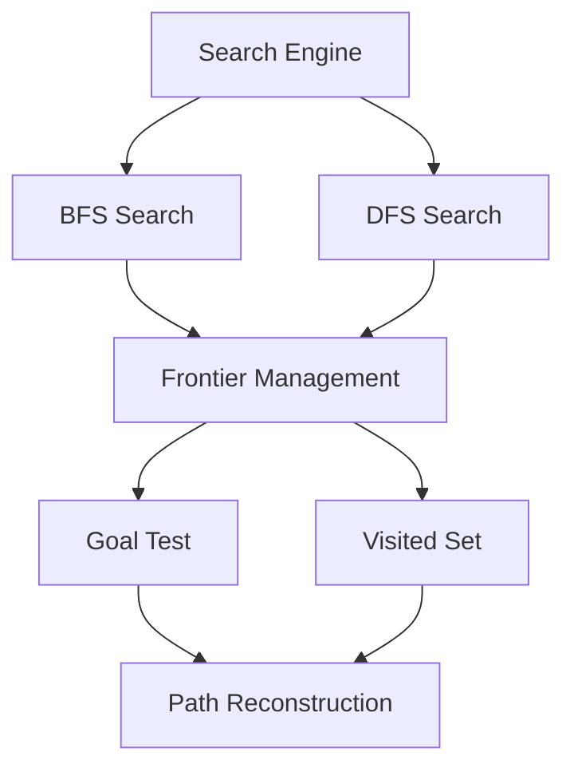

# C4 Level 3 – Component Diagram

**Selected container: Search Engine**

## Explanation
The Search Engine contains separate BFS and DFS search components so both algorithms can be applied to the same puzzle problem. Frontier Management controls states waiting to be explored. Goal Test checks whether the target configuration has been reached, while the Visited Set prevents unnecessary repeated exploration. Path Reconstruction produces the sequence of moves leading to the solution.
