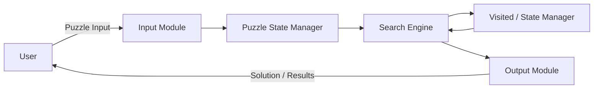

# C4 Level 2 – Container Diagram

## Containers

### 1. Input Module
Accepts the initial puzzle configuration from the user and prepares it for processing.

### 2. Puzzle State Manager
Represents puzzle states and handles the generation and management of valid neighboring states.

### 3. Search Engine
Runs the selected search strategy, BFS or DFS, to explore puzzle states and find the goal.

### 4. Visited / State Manager
Keeps track of explored states so repeated states can be avoided during search.

### 5. Output Module
Displays the solution path and relevant search/performance results to the user.
